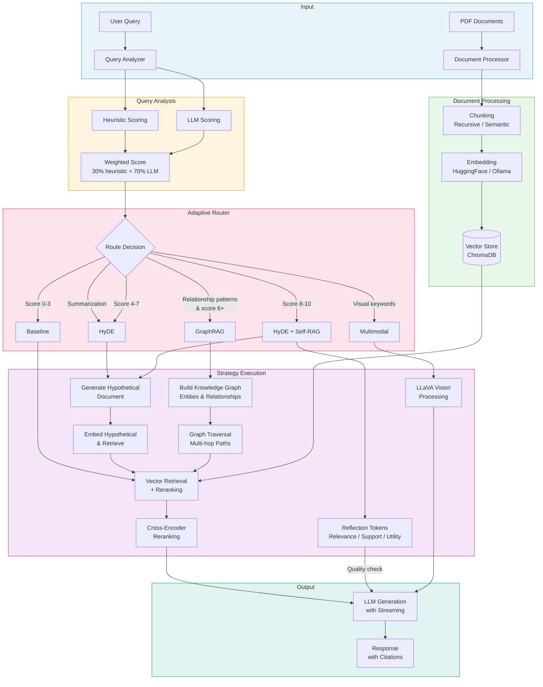
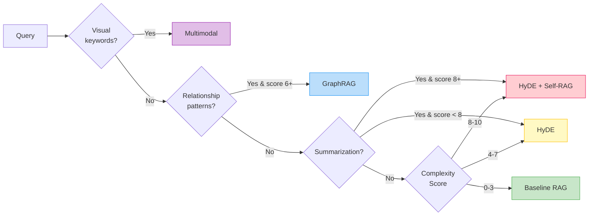

# Adaptive Multimodal RAG

A research project exploring automatic RAG strategy selection based on query complexity. The system analyzes incoming queries, assigns a complexity score, and routes them to the most appropriate retrieval and generation strategy.

## Motivation

Standard RAG systems use a fixed retrieval pipeline regardless of query complexity. Simple factual questions get the same treatment as complex analytical queries. This project explores whether automatic routing between different RAG techniques can improve results.

## System Architecture



## Query Routing Flow



## Implemented Techniques

### Baseline RAG
Standard retrieve-then-generate pipeline using vector similarity search with cross-encoder reranking.

### HyDE (Hypothetical Document Embeddings)
Based on [Gao et al., 2022](https://arxiv.org/abs/2212.10496). Generates a hypothetical answer first, then uses it for retrieval. This bridges the semantic gap between questions and documents.

### Self-RAG with Reflection Tokens
Based on [Asai et al., 2023](https://arxiv.org/abs/2310.11511). Generates reflection tokens to assess relevance, support, and utility of retrieved documents and generated answers. Regenerates if quality is low.

### GraphRAG
Based on [Edge et al., 2024](https://arxiv.org/abs/2404.16130). Builds a knowledge graph from documents by extracting entities and relationships. For multi-hop queries, traverses the graph to gather connected information before generating. Supports graph persistence -knowledge graphs can be saved to JSON and loaded across sessions without rebuilding.

### Cross-Encoder Reranking
Uses a cross-encoder model (ms-marco-MiniLM-L-6-v2) to rerank retrieved documents by relevance. The initial retrieval fetches a larger candidate set, then the cross-encoder scores each query-document pair to select the most relevant chunks.

### Multimodal Processing
Uses LLaVA for vision-based question answering on images, figures, and charts extracted from documents.

### Semantic Chunking
In addition to fixed-size recursive chunking, the system supports semantic chunking -splitting documents based on embedding similarity between sentences. This produces more coherent chunks that respect topic boundaries. Configurable via `documents.chunking_strategy` in `config.yaml` (`"recursive"` or `"semantic"`).

### Configurable Embedding Backend
Supports both HuggingFace (default: all-MiniLM-L6-v2) and Ollama (e.g., nomic-embed-text) as embedding backends. Configure via `embeddings.backend` in `config.yaml`.

## Query Routing

The router analyzes incoming queries and assigns a complexity score (0-10):

| Score | Complexity | Strategy | Rationale |
|-------|------------|----------|-----------|
| 0-3 | Simple | Baseline | Direct factual lookups |
| 4-7 | Medium | HyDE | Explanatory queries benefit from hypothetical document generation |
| 8-10 | Complex | HyDE + Self-RAG | Analytical queries need better retrieval and quality checks |
| 6+ | Multi-hop | GraphRAG | Relationship queries need graph traversal |
| any | Visual | Multimodal | Queries about images, figures, or charts |

Summarization queries (summary, overview, key findings, main contribution) are routed to HyDE regardless of complexity score, since they require document synthesis rather than direct lookup.

## Key Features

### Multi-Turn Conversation History
The system maintains conversation context across queries, allowing follow-up questions and context-aware responses. The full chat history is passed to the LLM for coherent multi-turn interactions.

### Token Streaming
Real-time token-by-token generation with stage-based progress updates in the UI. Streaming covers all pipeline stages -query analysis, retrieval, and generation -providing immediate feedback during processing.

### Caching System
Multi-layered caching with semantic query cache (caches full query-response pairs), vector search cache (caches embeddings), LRU eviction, TTL-based expiration, and automatic cleanup. Provides significant speedup for repeated or similar queries.

### Evaluation Framework
Built-in benchmarking system using LLM-as-judge metrics:
- **Faithfulness**: Whether the answer is grounded in retrieved context
- **Answer relevance**: How well the response addresses the query
- **Context precision**: Quality of retrieved documents
- **ROUGE-L**: Lexical overlap scoring

Run benchmarks with `python -m src.evaluation.benchmark`. Results are saved as JSON reports in `data/benchmarks/`.

### Debug Logging
Structured debug logs capture query analysis, routing decisions, retrieval results, and generated responses for all RAG interactions, aiding development and troubleshooting.

### Retry Logic and Error Handling
Exponential backoff retry logic (3 attempts) for Ollama API failures, connection validation, model availability checks, and graceful degradation across all LLM-facing components.

## Project Structure

```
src/
├── core/
│   ├── ollama_rag.py           # Base RAG with cross-encoder reranking
│   ├── config.py               # Configuration loading
│   ├── caching_system.py       # Query and embedding cache
│   ├── chunking.py             # Recursive and semantic chunking
│   ├── embeddings.py           # HuggingFace / Ollama embedding backend
│   └── debug_logger.py         # Structured debug logging
├── evaluation/
│   ├── benchmark.py            # Benchmark runner
│   └── metrics.py              # LLM-as-judge and ROUGE-L metrics
├── experiments/
│   ├── adaptive_routing/       # Query analysis and routing
│   ├── self_reflection/        # Self-RAG implementation
│   ├── graph_reasoning/        # GraphRAG with persistence
│   ├── streaming/              # Token streaming for UI
│   ├── hyde/                   # HyDE implementation
│   └── multimodal/             # LLaVA vision processing
└── ocr/
    └── advanced_ocr_engine.py  # Multi-backend OCR (EasyOCR, Tesseract)
```

## Setup

### Requirements
- Python 3.10+
- [Ollama](https://ollama.com/) for local LLM inference
- 8GB+ RAM (16GB recommended)

### Installation

```bash
git clone https://github.com/joehrz/adaptive-multimodal-rag.git
cd adaptive-multimodal-rag

python -m venv venv
source venv/bin/activate

pip install -r requirements.txt

# Install Ollama and pull a model
curl -fsSL https://ollama.com/install.sh | sh
ollama pull qwen2.5:3b
```

### Docker

```bash
docker compose up --build
```

The Docker setup runs both the Ollama server and the Streamlit app with persistent volumes for models and data. Set `RAG_OLLAMA_URL` to override the Ollama endpoint. GPU passthrough is supported -see `docker-compose.yaml` for configuration.

### Running

```bash
# Web interface
streamlit run app.py

# CLI for testing and debugging
python cli_query.py
```

The CLI supports interactive commands including `/verify` (verify last answer), `/chunks` (show retrieved chunks), `/route` (show routing decision), `/strategy` (change strategy), and `/stats` (show cache statistics).

## Configuration

Edit `config.yaml` to customize models, reranking, retrieval parameters, and routing thresholds. Key settings:

- `llm.model`: Ollama model (default: qwen2.5:14b)
- `embeddings.backend`: `"huggingface"` or `"ollama"` (default: huggingface)
- `embeddings.model`: Embedding model (default: all-MiniLM-L6-v2)
- `documents.chunking_strategy`: `"recursive"` or `"semantic"` (default: recursive)
- `reranker.enabled`: Toggle cross-encoder reranking (default: true)
- `reranker.candidates`: Number of initial candidates before reranking (default: 30)
- `reranker.top_k`: Number of documents kept after reranking (default: 10)
- `documents.chunk_size`: Document chunk size in characters (default: 1000)
- `cache.enabled`: Toggle caching (default: true)
- `cache.ttl_seconds`: Cache time-to-live (default: 3600)

Environment variables `RAG_OLLAMA_URL` and `RAG_OLLAMA_TIMEOUT` override the corresponding config values.

## Testing

```bash
# Unit tests (no Ollama needed)
pytest tests/

# Integration tests against real PDFs (requires Ollama running)
python tests/integration/run_quality_tests.py
```

### CI/CD

GitHub Actions runs on every push and pull request, testing against Python 3.10, 3.11, and 3.12. The pipeline includes dependency caching, import validation, config checks, unit tests, and linting.

## Models

Tested with:
- **Language**: Qwen 2.5 (3B, 7B, 14B), Llama 3.1, Mistral
- **Vision**: LLaVA 7B/13B (for multimodal)
- **Embeddings**: all-MiniLM-L6-v2 (HuggingFace), nomic-embed-text (Ollama)
- **Reranker**: cross-encoder/ms-marco-MiniLM-L-6-v2

Any Ollama-compatible model should work for language and vision.

## Limitations

- Query complexity scoring is heuristic-based, not learned
- GraphRAG entity extraction depends on LLM quality
- Multimodal processing is slow (requires vision model inference)

## References

- Gao et al. (2022). [Precise Zero-Shot Dense Retrieval without Relevance Labels](https://arxiv.org/abs/2212.10496)
- Asai et al. (2023). [Self-RAG: Learning to Retrieve, Generate, and Critique through Self-Reflection](https://arxiv.org/abs/2310.11511)
- Liu et al. (2023). [Visual Instruction Tuning](https://arxiv.org/abs/2304.08485)
- Edge et al. (2024). [From Local to Global: A Graph RAG Approach](https://arxiv.org/abs/2404.16130)

## License

MIT
