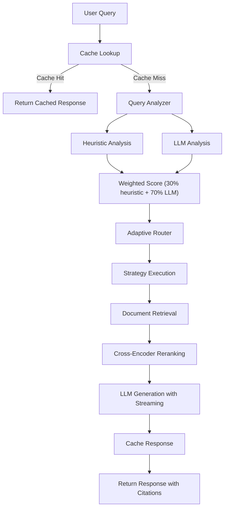
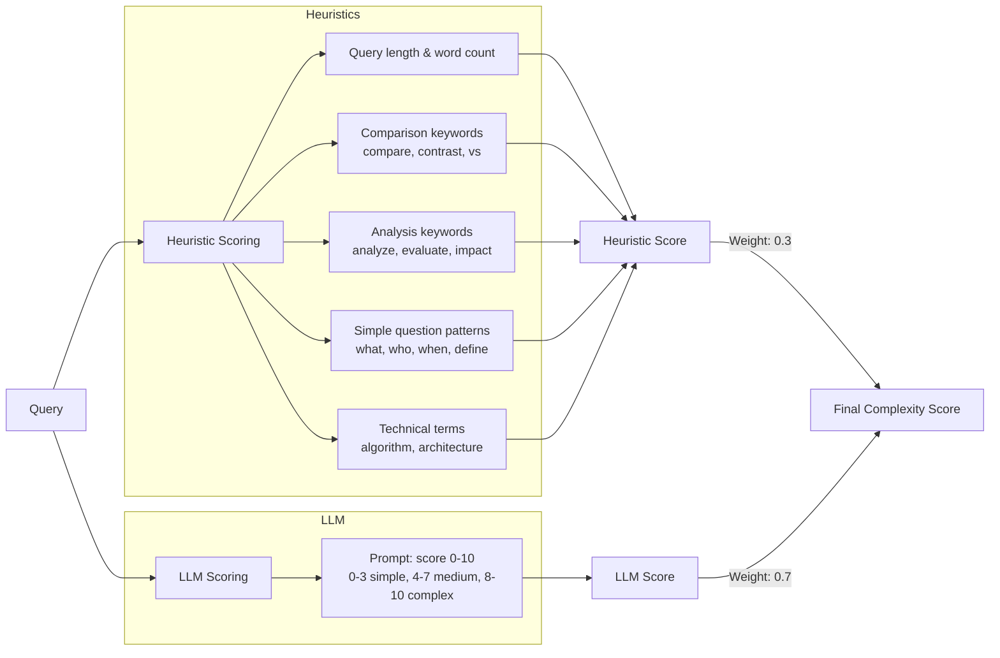
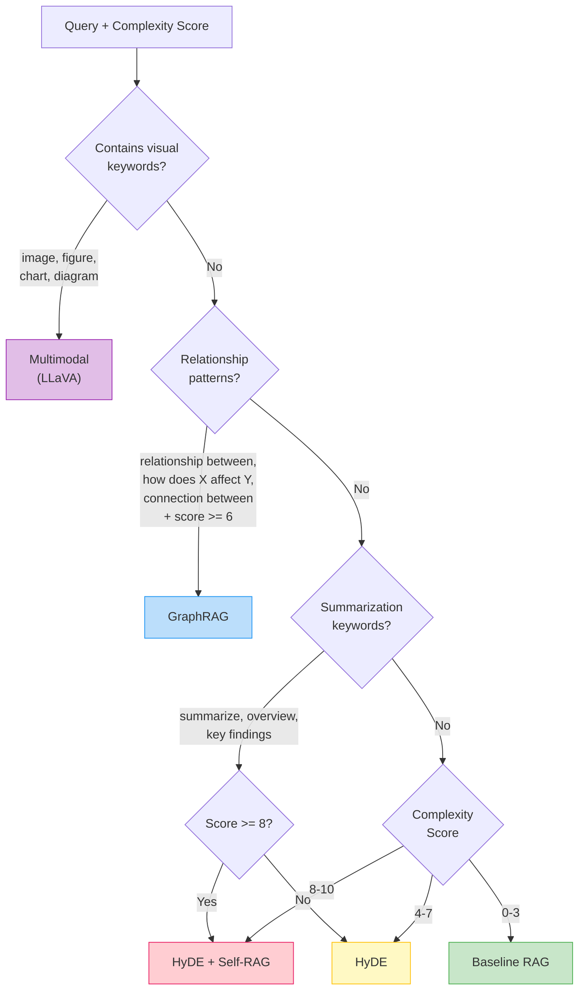
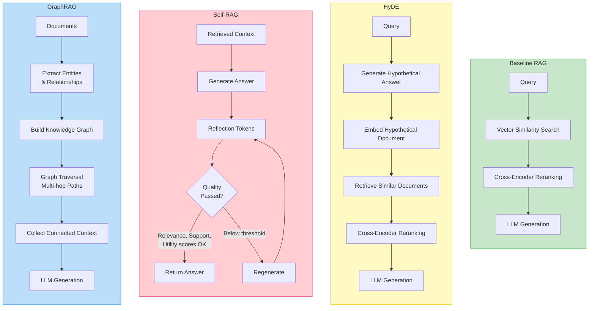
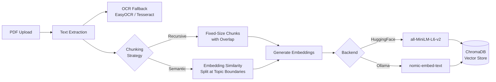
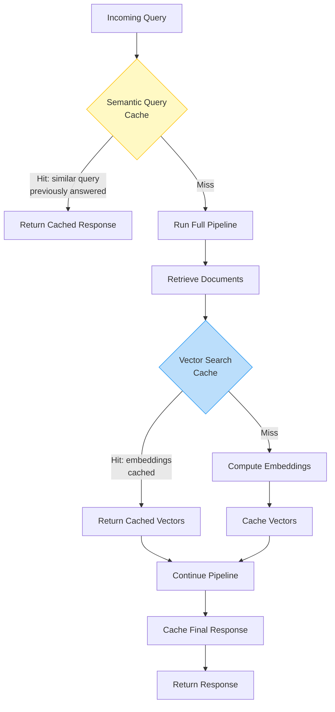

# Architecture

Detailed diagrams of the Adaptive Multimodal RAG system internals.

## End-to-End Pipeline

How a query flows through the system from input to response.

## Query Analysis

The analyzer combines fast heuristic signals with LLM judgment to score query complexity on a 0-10 scale.

## Routing Decision Tree

The router checks query characteristics in priority order. The first matching rule wins.

## Strategy Details

What each RAG strategy does after routing.

## Document Processing Pipeline

How uploaded PDFs become searchable vector embeddings.

## Caching Layers

The caching system sits between the user and the pipeline to avoid redundant computation.

